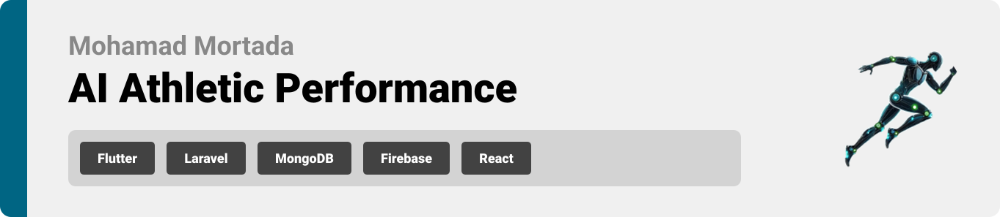
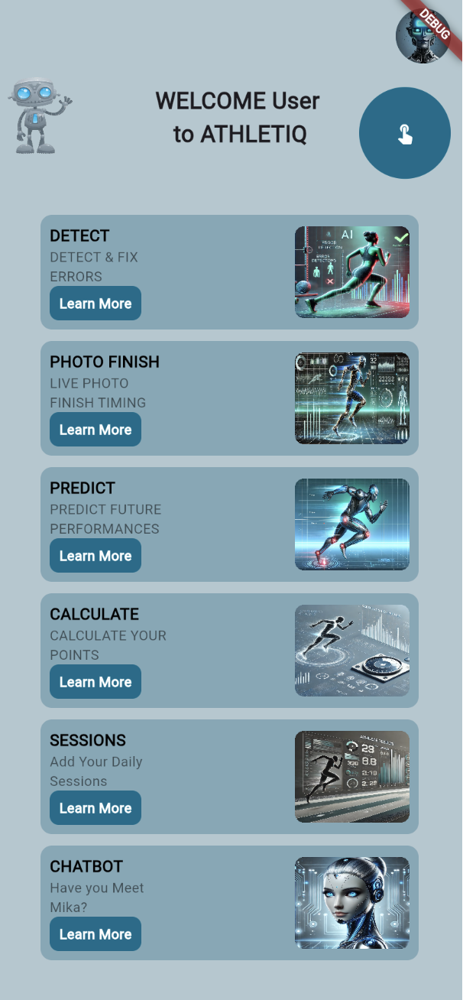
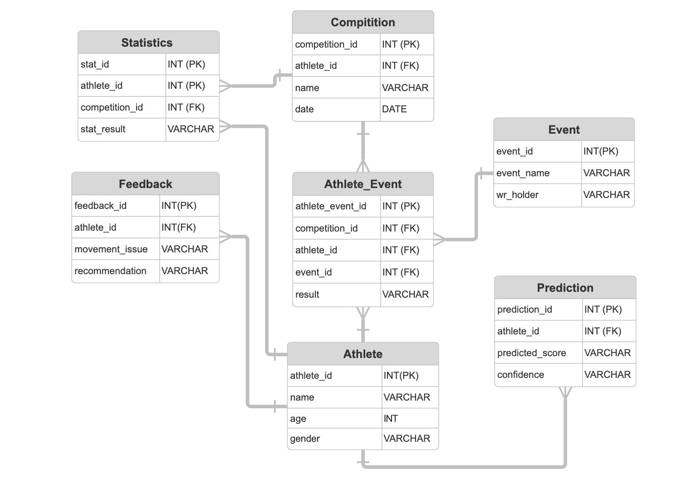
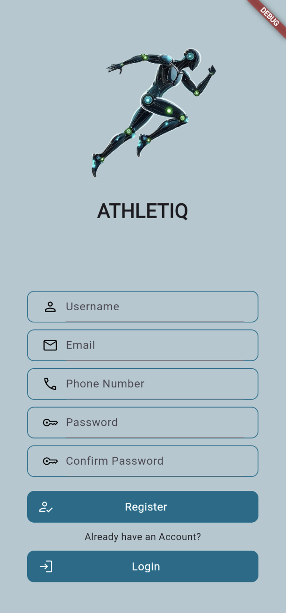
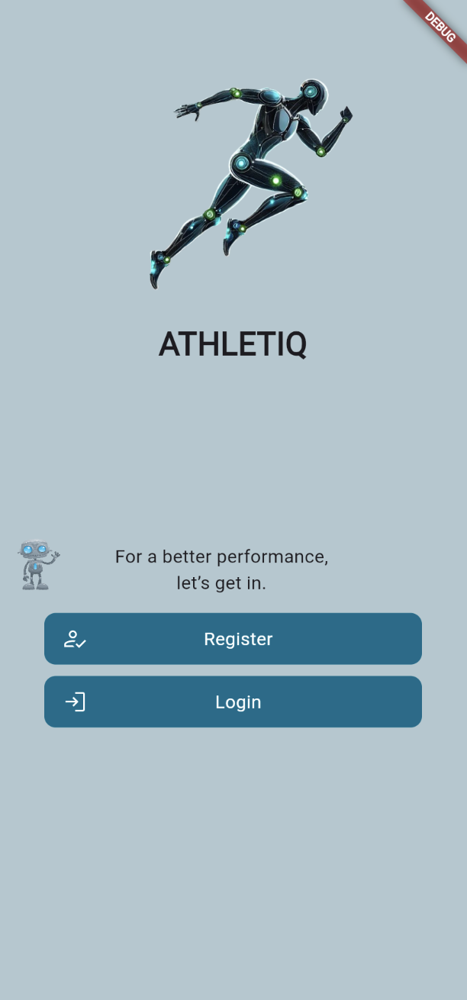
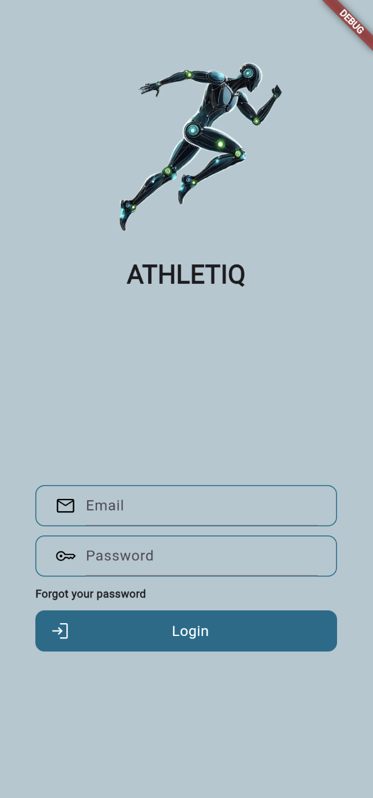
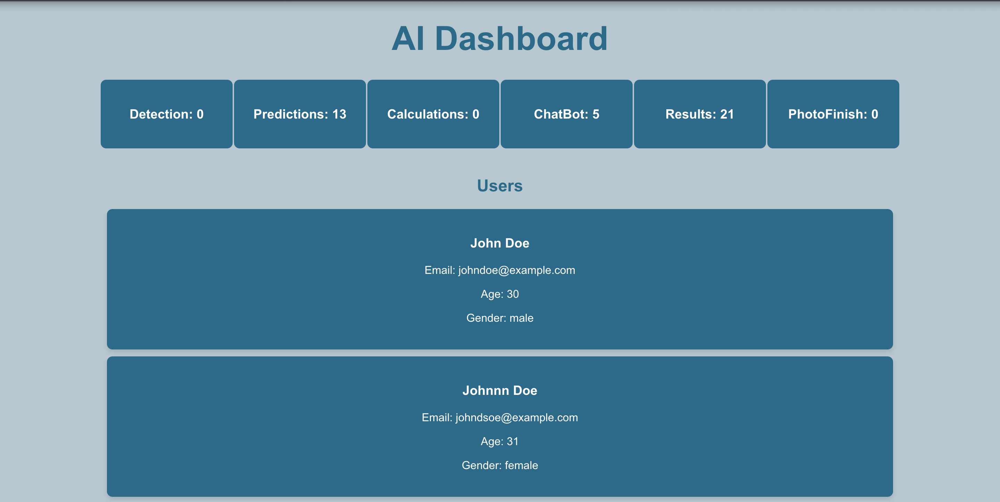
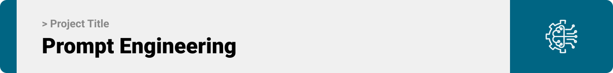

<br><br>

<!-- project philosophy -->


<<<<<<< HEAD
AI Athletic Performance helps athletes detect and fix their running technique, give accurate photo finish timing, and predict future results for upcoming competitions.

### User Stories
* As an Athlete,
   - I want real-time feedback on my exercises, so I can correct my form and avoid injuries.

   - I want progress reports that show my performance improvements, so I can stay motivated and adjust my goals.

   - I want to get an accurate prediction of my performance, so I can know my abilities before any compitition.

* As an Admin,
   - I want to see all things going on on my app, so I can have a detailed analysis of what features athletes are mostly.

   - I want to know what age category is this app is aimed to, so I can know what user interface I would be using.
   - I want to know kind of athletes this app is aimed to, sprinters, long distance runners or jumpers, so I can add features as it suites the audience.
=======

<br><br>
<!-- Tech stack -->


###  AI Athletic Performance is built using the following technologies:

- This project uses the [Flutter app development framework](https://flutter.dev/). Flutter is a cross-platform hybrid app development platform which allows us to use a single codebase for apps on mobile, desktop, and the web.
- For the backend, the app uses the [Laravel framework](https://laravel.com/). Laravel uses MVC design pattern and give a very clean code.
- For AI features, the app uses Python as a backend to create APIs suitable for such features.
- For persistent storage (database), the app uses the [MySQL](https://www.mysql.com/) package which allows the app to create a custom storage schema and save it to a local database.
- For the dashboard, the frontend is made of pure [React](https://react.dev/), and it's deployed online.
- For AI tools, Google Mediapipe (https://mediapipe-studio.webapps.google.com/studio/demo/pose_landmarker), OpenCV (https://opencv.org/), & OpenAI (https://openai.com/index/openai-api/) are used.


<br><br>
<!-- UI UX -->


> We designed Coffee Express using wireframes and mockups, iterating on the design until we reached the ideal layout for easy navigation and a seamless user experience.

- Project Figma design [figma]([https://www.figma.com/file/LsuOx5Wnh5YTGSEtrgvz4l/Purrfect-Pals?type=design&node-id=257%3A79&mode=design&t=adzbABt5hbb91ucZ-1](https://www.figma.com/design/KAZsRwNccV60g4ig9fojpF/Untitled?node-id=45-528&t=VohoaqbpumpH7PGU-0))


### Mockups
| Home screen  | Detect Screen | Predict Screen |
| ---| ---| ---|
|  |  |  |

<br><br>

<!-- Database Design -->


###  Architecting Data Excellence: Innovative Database Design Strategies:

- Insert ER Diagram here


<br><br>


<!-- Implementation -->


### User Screens (Mobile)
| Detect screen  | Main screen | Predict screen 
| ---| ---| ---|
|  |  |  |
| Register screen  | OnBoarding Screen | Login Screen |
|  |  |  | 

### Admin Screens (Web)
| Dashboard Screen  |
| ---|
|  |

<br><br>


<!-- Prompt Engineering -->


###  Mastering AI Interaction: Unveiling the Power of Prompt Engineering:

- This project uses Mediapipe and OpenCV to analyze athletes' movements and detect their performance in real time and to give accurate photo finish timing. It also integrates OpenAI to provide smart predictions and feedback, helping athletes improve their running technique, get accurate timing, and plan for future competitions.

<br><br>

<!-- How to run -->


> To set up Coffee Express locally, follow these steps:

### Prerequisites

This is an example of how to list things you need to use the software and how to install them.
* npm
  ```sh
  npm install npm@latest -g
  ```

### Installation

_Below is an example of how you can instruct your audience on installing and setting up your app. This template doesn't rely on any external dependencies or services._

1. Get a free API Key at [example](https://example.com)
2. Clone the repo
   git clone [github](https://github.com/your_username_/Project-Name.git)
3. Install NPM packages
   ```sh
   npm install
   ```
4. Enter your API in `config.js`
   ```js
   const API_KEY = 'ENTER YOUR API';
   ```

Now, you should be able to run Coffee Express locally and explore its features.
